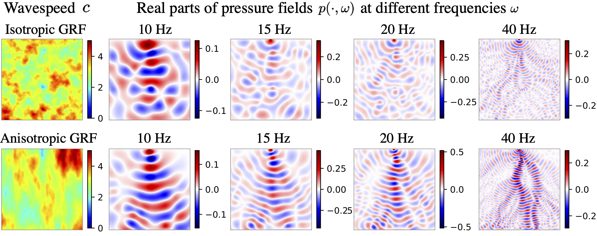
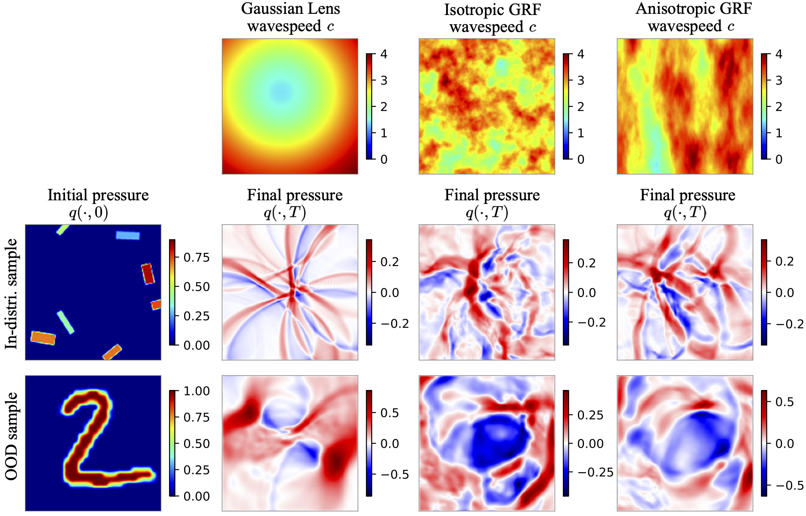
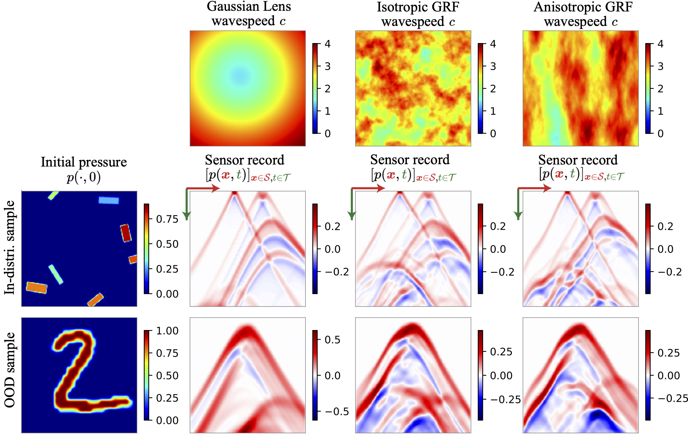

[](https://doi.org/10.5281/zenodo.8015145)


# WaveBench

👋 Welcome to WaveBench!

WaveBench provides a comprehensive collection of datasets designed for training machine learning-based solvers to wave propagation partial differential equations (PDEs).

Our datasets are [available on Zenodo](https://zenodo.org/record/8015145).

# Quick start: Explore Wavebench on Google Colab

We provide Google Colab notebooks to explore Wavebench. With these notebooks, you can easily train a PDE surrogate, such as FNO or U-Net, on one of the Wavebench datasets directly in your browser. No manual installation or downloads are required.

|Title  | Notebooks |
| --- | --- |
| Train models on time-varying Wavebench datasets  | [](https://colab.research.google.com/drive/1wrmSgIRomwrLw68X6TLeUWEYOiTFPycl?usp=sharing)|
| Train models on time-harmonic Wavebench datasets  | [](https://colab.research.google.com/drive/1Ug8YRBv6VUrrf7iZxeaId3rBXsBnvqus?usp=sharing)|


# Dataset Description

The benchmark dataset contains two variants of wave propagation problems, **time-harmonic** and **time-varying**.


## Time-harmonic wave problems

In the time-harmonic wave problems, we aim to learn a mapping that associates wavespeeds $c = c(\boldsymbol{x})$ with a pressure field $p = p(\boldsymbol{x}, \omega)$ at a prescribed frequency $\omega$. Here, $\boldsymbol{x}$ is a spatial coordinate in 2D.

The time-harmonic datasets consist of paired wavespeed and pressure fields $\{(c_j, p_j)\}_{j}$. The following illustrates samples of wavespeed $c$ and pressure field $p(\cdot, \omega)$ at different frequencies.

<br />
<p align="center">

</p>


## Time-varying wave problems

Time-varying wave problems comprise two categories: **reverse time continuation** and **inverse source** problems.

### Reverse time continuation (RTC)

The objective in **RTC** is to map a pressure field $q = q(\boldsymbol{x}, T)$ at the final time $T$ to the pressure field $q = q(\boldsymbol{x}, 0)$ at the initial time $0$. The figure below shows training samples of $q(\cdot, 0)$ and $q(\cdot, T)$. Various versions of the dataset are available, each simulated with a fixed wavespeed $c$ as shown in the top row. While the final pressure depends both on the initial pressure and the wavespeed, the mapping we aim to estimate is based on a fixed wavespeed.

<br />
<p align="center">

</p>

### Inverse source (IS)

In IS, the aim is to predict the initial pressure $q(\cdot, 0)$ based on pressure measurements collected at specific boundary locations over a time interval $[0, T]$. This dataset is inspired by seismic imaging, where pressure field measurements are only feasible at the earth's surface. We offer different versions of this dataset, each with a fixed wavespeed $c$ as depicted in the first row.

<br />
<p align="center">

</p>


# Usage

## Explore on Google Colab
We provide Google Colab notebooks for the purpose of exploring Wavebench. You can find the links to these notebooks in the table of the "Quick start" section above.

## Install Wavebench

We suggest using Conda to install Wavebench. The following commands will create a new Conda environment named `wavebench` and install the dependencies.

```
conda create -y -n wavebench python=3.9 cupy pkg-config libjpeg-turbo opencv pytorch torchvision cudatoolkit=11.3 numba -c pytorch -c conda-forge
conda activate wavebench
pip install ffcv matplotlib jupyterlab pytorch-lightning einops ml-collections wandb
git clone https://github.com/wavebench/wavebench.git
cd wavebench
pip install -e .
```

# Dataset

Our datasets are available on [the Zenodo page](https://zenodo.org/record/8015145). It has the persistent DOI `10.5281/zenodo.8015144`. We also host the datasets using on the [SwitchDrive link here](https://drive.switch.ch/index.php/s/L7LeTyb9B9HMuG6). These datasets are in the `.beton` format that allows for fast data loading with [FFCV loaders](https://ffcv.io/). The FFCV dadaloaders are drop-in replacements for PyTorch dataloaders but are optimized for increasing data throughput in model training.


To download our datasets from Zenodo page, visit [the Zenodo page](https://zenodo.org/record/8015145). You can also download these datasets from SwitchDrive using the following command:

```
curl -O -J https://drive.switch.ch/index.php/s/L7LeTyb9B9HMuG6/download
```

Unzip the downloaded file `wavebench_datasets.zip` at the root directory of this repository. Inside the unzipped `wavebench_datasets` folder, you will find all the datasets. That is, the overal directory structure should be the following:

```
📂 wavebench
|_📁 notebooks
|_📁 saved_figs
|_📁 src
|_📁 wavebench
|_📁 wavebench_datasets  # <-- The dataset folder you downloaded & upzipped.
  |_📁 time_harmonic
  |_📁 time_varying
|_📄 .pylintrc
|_📄 LICENSE.txt
|_📄 README.md
|_📄 setup.py
```

# Checkpoints of baseline models

We provide checkpoints of baseline U-Nets and FNOs [here](https://drive.google.com/drive/folders/11xLtRWP3q31ki_r4vsV09yM84BPffcJU?usp=sharing). These checkpoints can be used to reproduce the results in our paper (preprint in preparation). The checkpoints are in the `.ckpt` format and can be loaded with PyTorch Lightning's `load_from_checkpoint` function.

```python
from wavebench.nn.pl_model_wrapper import LitModel

model = LitModel.load_from_checkpoint("path/to/model.ckpt")
model.eval()
```

# Citation

We are preparing a preprint for this work.

## License
MIT licensed. See `LICENSE.txt` file.